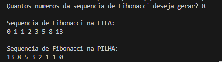

## 🛠️ Estruturas Implementadas
- **Classe Fila**
  - `Inserir(Fila* F, int N)` → insere um novo elemento no final da fila.  
  - `Listar(Fila* I)` → percorre e imprime todos os elementos da fila.  

- **Classe Pilha**
  - `InserirPilha(Pilha* T, int N)` → insere um novo elemento no topo da pilha.  
  - `PercorrerPilha(Pilha* T)` → percorre e imprime todos os elementos da pilha.  

---

## ▶️ Execução
1. O programa pergunta ao usuário **quantos números da sequência de Fibonacci** deseja gerar.  
2. Os números são gerados um a um e armazenados **simultaneamente** em:
   - uma **fila** (ordem de geração)  
   - uma **pilha** (ordem inversa de geração)  
3. Ao final, o programa imprime:
   - A sequência de Fibonacci armazenada na **fila**.  
   - A sequência de Fibonacci armazenada na **pilha**.  

---

## 📋 Exemplo de Uso

